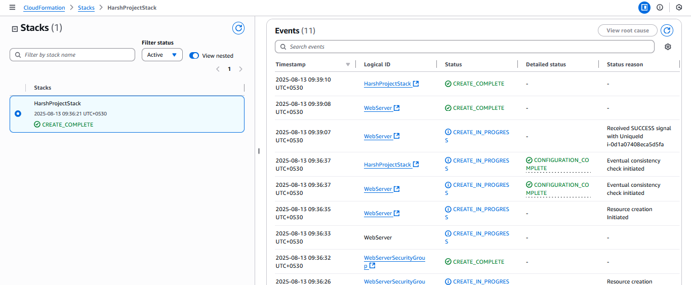
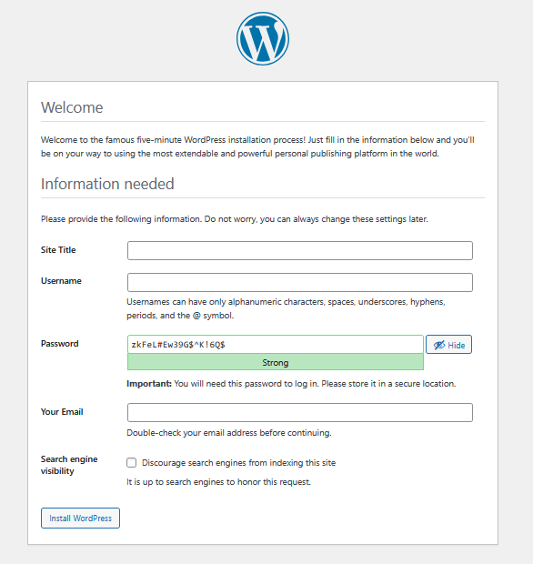

# Deploying a Scalable WordPress Site on AWS with CloudFormation

This project automates the deployment of a highly available and scalable WordPress website on Amazon Web Services (AWS) using Infrastructure as Code (IaC). The entire infrastructure is defined in a CloudFormation template, ensuring a reliable, repeatable, and fast setup process.

## 🚀 Project Overview

The goal of this project is to move beyond manual setup and leverage AWS CloudFormation to build a robust environment for WordPress. This includes a custom Virtual Private Cloud (VPC) for network isolation, an Application Load Balancer (ALB) to distribute traffic, an Auto Scaling Group (ASG) for EC2 instances to handle load, and a Relational Database Service (RDS) instance for the database.

## 🏛️ Architecture

This project provisions the following AWS resources:

* **VPC**: A custom VPC with a `10.0.0.0/16` CIDR block, configured with public subnets across two Availability Zones for high availability.
* **Internet Gateway**: Allows communication between the VPC and the internet.
* **Application Load Balancer**: Distributes incoming HTTP traffic across multiple EC2 instances.
* **Auto Scaling Group**: Automatically adjusts the number of EC2 instances to maintain performance and availability. The group is configured to run a minimum of 2 instances.
* **EC2 Instances**: Amazon Linux 2 instances that are automatically configured with a web server (Apache), PHP, and the WordPress application files at launch time using a User Data script.
* **RDS**: A MySQL database instance running on RDS, located in the private subnets to ensure it is not accessible from the public internet.
* **Security Groups**: Network firewalls that control traffic to the ALB, EC2 instances, and the RDS database, ensuring a secure setup.

## ✨ Project Screenshots

Here is the result of the successful CloudFormation stack creation and the final WordPress installation screen.

**1. CloudFormation Stack Created Successfully**  


**2. WordPress Site Running**  


## 🛠️ How to Deploy (Replicating This Project)

You can clone this repository and deploy the stack in your own AWS account by following these steps.

### Prerequisites

1.  An **AWS Account**.
2.  **AWS CLI** configured on your local machine (optional, you can also use the AWS Management Console).
3.  An **EC2 Key Pair** created in your target AWS region. You will need to provide the name of this key pair when launching the stack.

### Deployment Steps

1.  **Clone the repository:**
    ```bash
    git clone https://github.com/harshraisaxena/aws-wordpress-cloudformation.git
    cd aws-wordpress-cloudformation
    ```

2.  **Create the CloudFormation Stack:**

    You can use the AWS Management Console or the AWS CLI.

    **Using AWS Management Console:**
    * Navigate to the CloudFormation service in the AWS Console.
    * Click on "Create stack" and choose "With new resources (standard)".
    * Select "Upload a template file" and upload the `cloudformation-template.yml` file from this repository.
    * Give the stack a name (e.g., `MyWordPressSite`).
    * Fill in the parameters:
        * `DBPassword`: Create a strong password for the database.
        * `KeyName`: Select your existing EC2 Key Pair from the dropdown.
    * Proceed through the next steps and click "Create stack".

    **Using AWS CLI:**
    * Run the following command in your terminal. Make sure to replace `<YOUR-STACK-NAME>`, `<YOUR-DB-PASSWORD>`, and `<YOUR-KEY-PAIR-NAME>` with your actual values.
    ```bash
    aws cloudformation create-stack \
      --stack-name <YOUR-STACK-NAME> \
      --template-body file://cloudformation-template.yml \
      --parameters \
        ParameterKey=DBPassword,ParameterValue=<YOUR-DB-PASSWORD> \
        ParameterKey=KeyName,ParameterValue=<YOUR-KEY-PAIR-NAME> \
      --capabilities CAPABILITY_IAM
    ```

3.  **Access Your WordPress Site:**
    * Wait for the stack creation to complete (it can take 10–15 minutes). The status will change to `CREATE_COMPLETE`.
    * Go to the **Outputs** tab of your stack in the CloudFormation console.
    * You will find the `WordPressURL`. Click this link to access your new WordPress site and complete the setup.

## 🧹 Clean Up

To avoid ongoing charges, remember to delete the stack when you are finished.

* Navigate to the CloudFormation service.
* Select the stack you created.
* Click "Delete". This will terminate all the resources that were created by the template.
